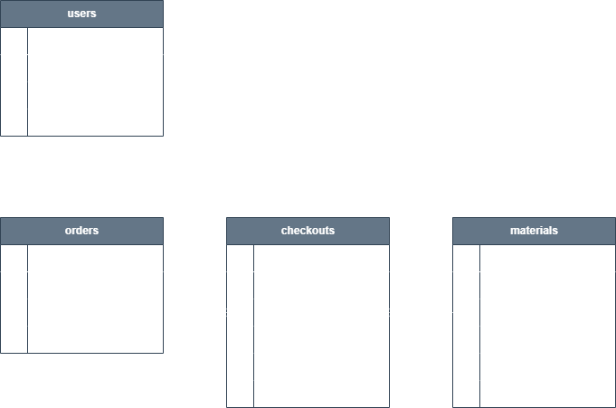
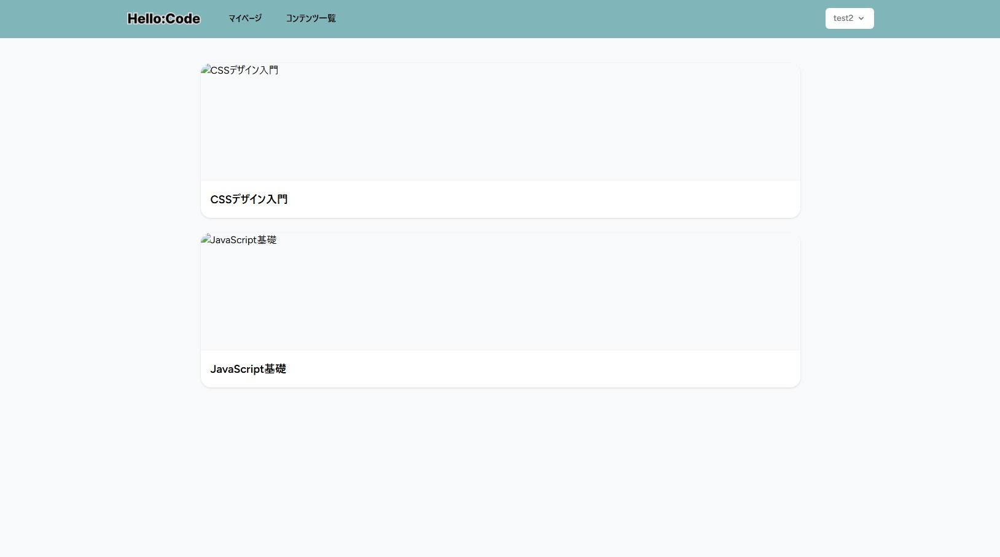
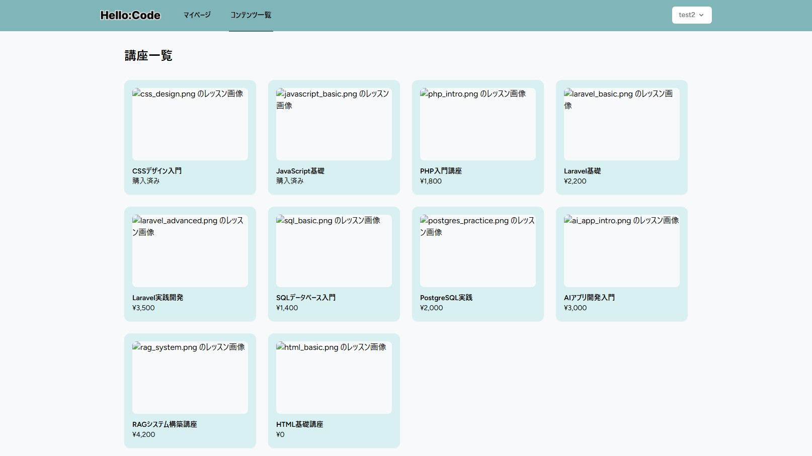
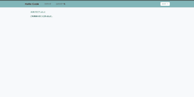
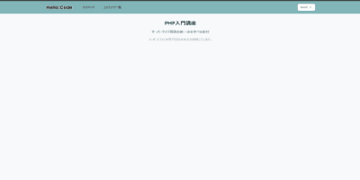
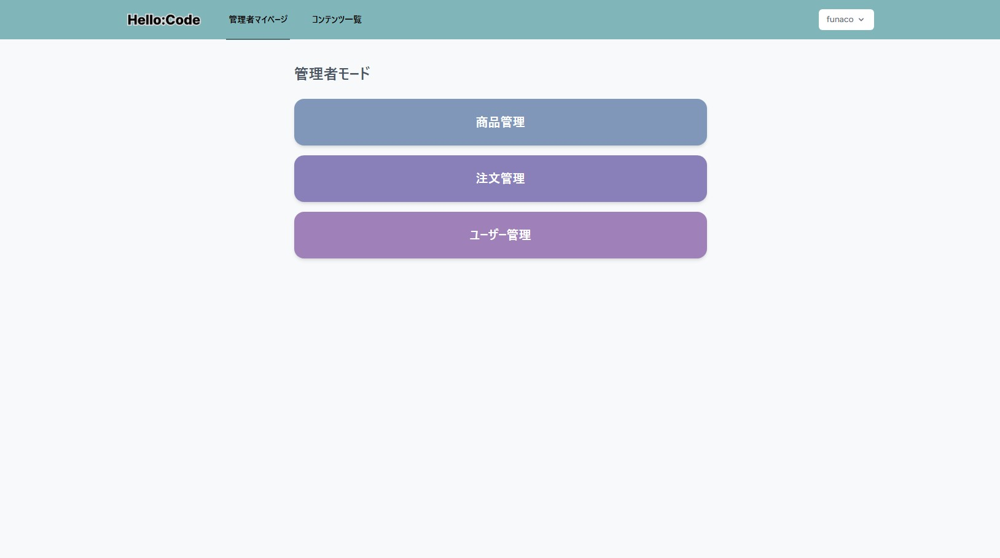
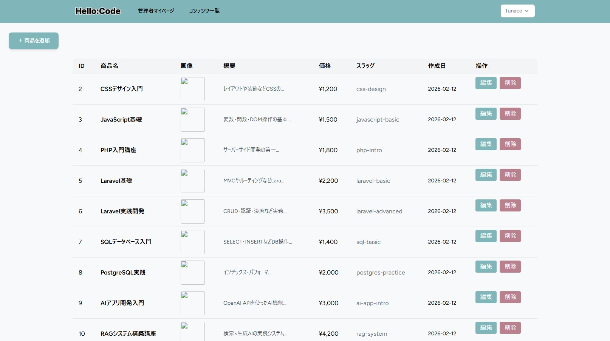
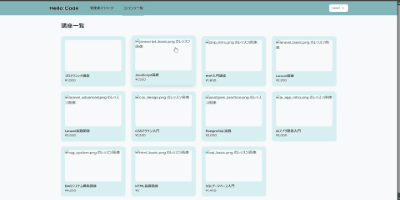
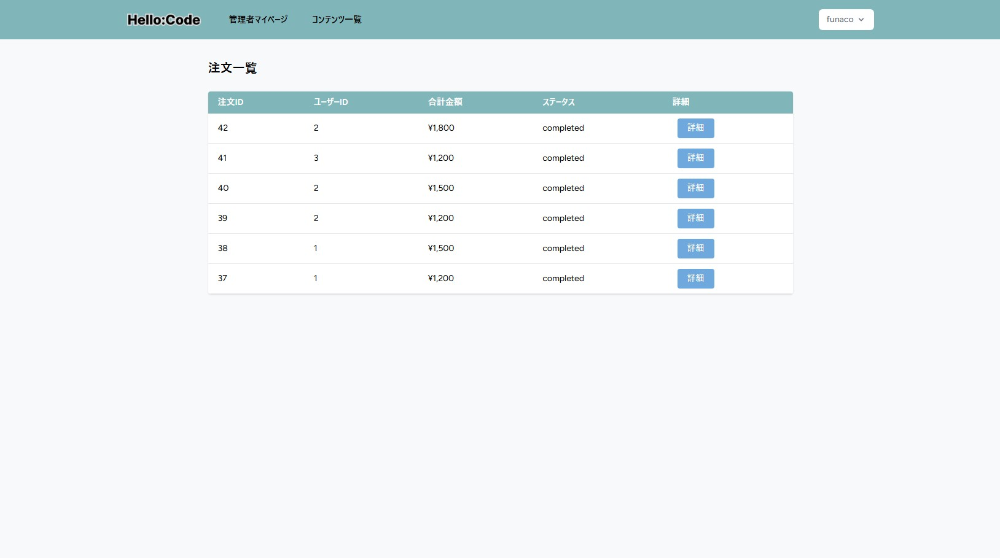
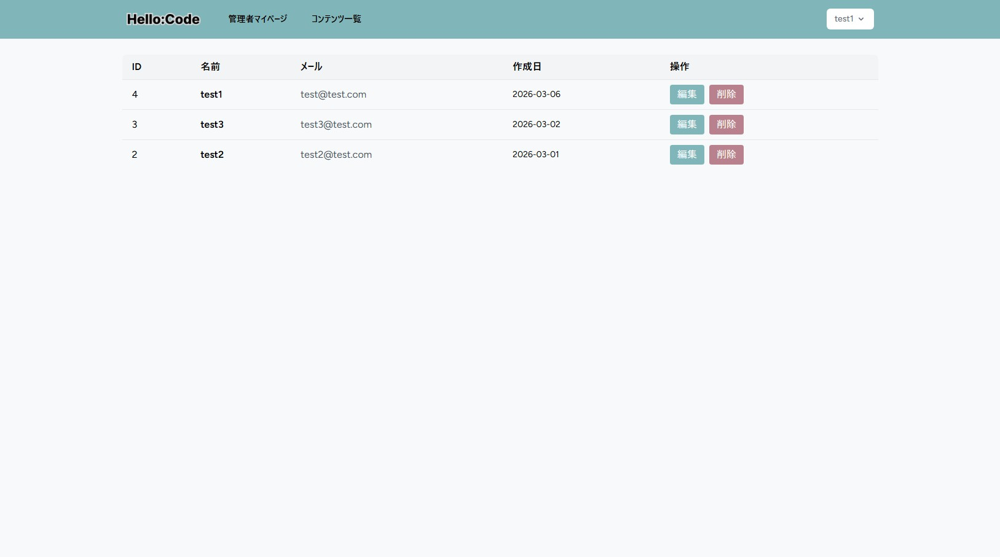

# ECsite「Hello:Code」

## 概要

開発スキル向上のため、プログラミング教材販売サイト「Hello:Code」を作成しました。
本プロジェクトは、フロントエンドに Bladeテンプレート、バックエンドに PHP / Laravel を使用したマルチページアプリケーションです。現在はローカル開発環境（Docker 上の app / nginx / DB コンテナ）で動作しており、本番環境は現在準備中です。

## 開発環境（フロントエンド）

画面の作成には、LaravelのBladeを使用しました。
サーバー側で画面を作ることで、シンプルで管理しやすい構成にしています。
デザインにはTailwind CSSを使用し、効率よく見た目を整えられるようにしました。

## 開発環境（バックエンド）

バックエンドにはPHPとLaravelを使用しています。
ログインや会員登録などの機能はLaravel Breezeを使って実装しました。

開発環境はDockerを用いて構築し、アプリケーション・Webサーバー・データベースをそれぞれコンテナとして分離しています。各コンポーネントを独立して管理することで、環境の再現性や保守性を高めています。

## データベース

データベースには PostgreSQL を使用しました。
高い安定性と信頼性を持ち、Webアプリケーション開発でも広く利用されているため採用しました。

## 動作環境

Google Chrome

## ER図

## 画面

## ユーザー機能
・ユーザーマイページ

・商品一覧

・購入処理(gif)  
  

・購入品の確認(gif)  
  

## 管理者機能
・管理者マイページ

・商品一覧
  
・商品登録(gif)  
  
・注文一覧

・ユーザー一覧

